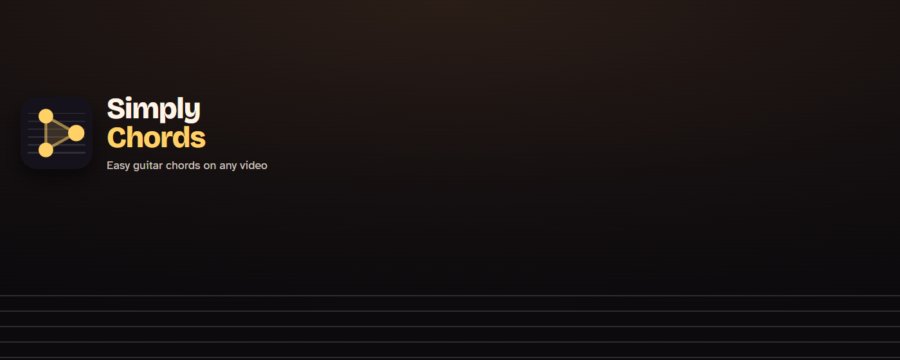
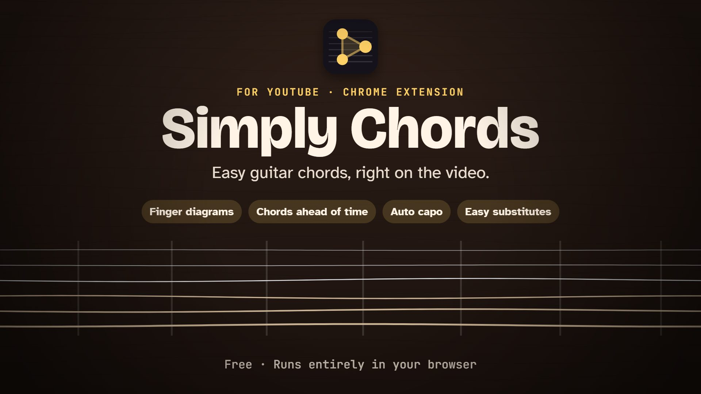
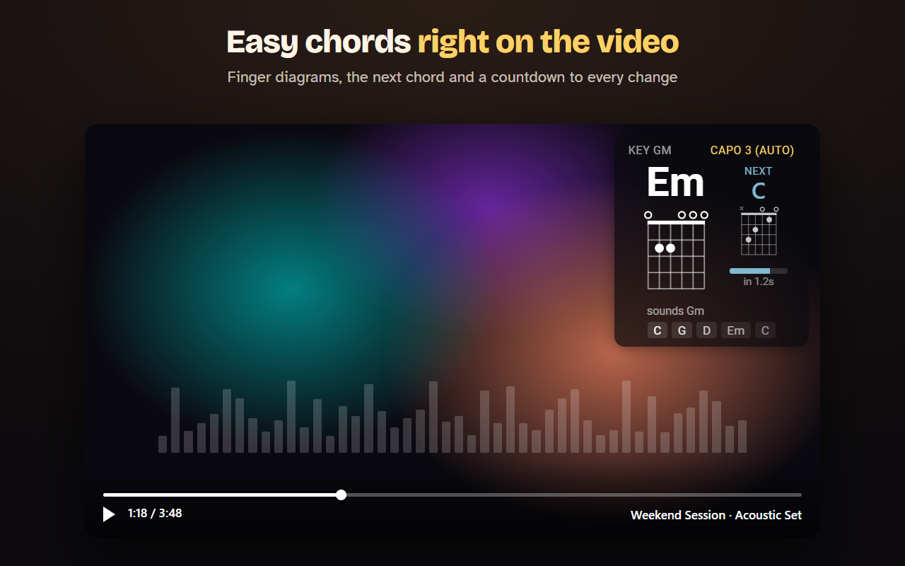
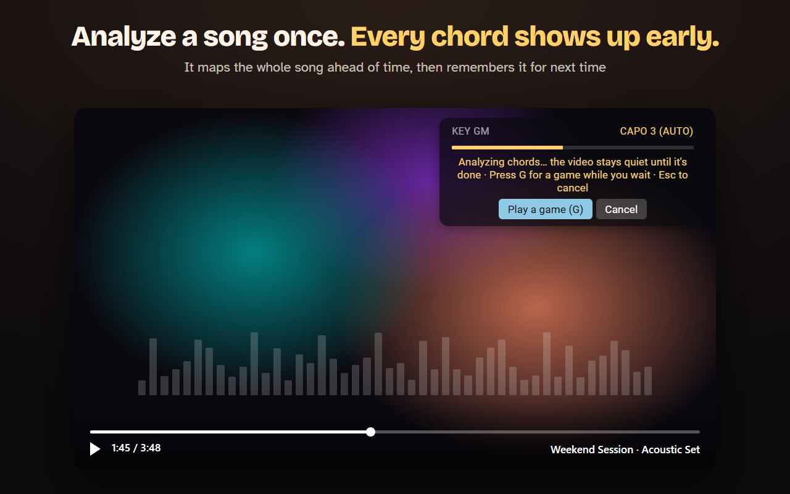
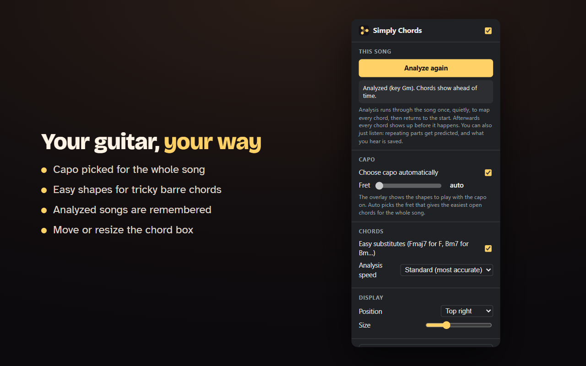
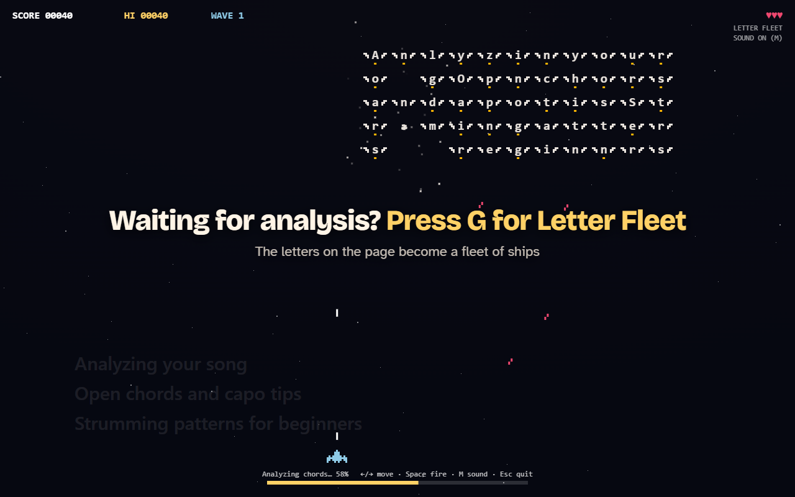

# Simply Chords

**Easy guitar chords, right on the video.**

A free Chrome extension that shows the chords of the song you're watching on YouTube, 
with finger diagrams, an automatic capo, and a countdown to every change.

[**Website**][website] · [**Guide**][guide] · [**Privacy**][privacy] · [**Add to Chrome**][store]

 

 

## Play along in three steps

1. **Open a song** on YouTube or YouTube Music.
2. **Click the page once and press play.** Browsers only let a page hear sound after you've clicked it.
3. **Play along.** The chord to play now, its finger diagram, and the next chord with a countdown appear on the video.

Click **Analyze this song** and Simply Chords maps the whole song ahead of time, so every chord shows up *before* it happens. Analyzed songs are remembered.

 

## See it in 48 seconds

[][tour]

Click to watch the tour on the website.

 

## What it looks like

<table>
  <tr>
    <td width="50%" valign="top">
      
      
<b>The chord box.</b> The chord to play, how to finger it, what's next and when, plus the rest of the progression.

    </td>
    <td width="50%" valign="top">
      
      
<b>Analyze this song.</b> Map the whole song once, and every chord shows up early from then on.

    </td>
  </tr>
  <tr>
    <td width="50%" valign="top">
      
      
<b>Your guitar, your way.</b> Auto capo, easier shapes for barre chords, and a chord box you can move and resize.

    </td>
    <td width="50%" valign="top">
      
      
<b>Letter Fleet.</b> Press <kbd>G</kbd> while a song is analyzed and the letters on the page become a fleet of ships.

    </td>
  </tr>
</table>

 

## Made for acoustic guitar

| | |
|---|---|
| **Simple chords** | Major and minor only. 7ths and power chords become the easy chord that fits the song's key. |
| **Auto capo** | One capo fret for the whole song, chosen to give the easiest open shapes. |
| **Easy substitutes** | F, Bm, B and F#m swapped for open shapes you can actually play (Fmaj7, Bm7, B7, F#m7). |
| **Finger diagrams** | For the current chord and the next one, adjusted for the capo. |
| **Any tuning** | Works when the recording or the guitar isn't tuned exactly to concert pitch. |
| **Acoustic or electric** | Tuned for acoustic songs, and handles distorted electric guitar too. |

 

## Private by design

- All listening happens **inside your browser**. Audio is processed as it plays and is never recorded, saved or sent anywhere.
- **No account, no ads, no tracking.** Nothing is collected about you.
- Settings and analyzed songs are kept in Chrome's own storage on your device. Removing the extension removes them.

Full details in the [privacy policy][privacy].

 

## Under the hood

Simply Chords is plain JavaScript with no outside services. For each moment of the song it:

1. **Estimates the tuning**, so slightly sharp or flat recordings still line up with the right notes.
2. **Works out which notes are ringing**, modelling each string's overtones so they aren't mistaken for chord notes.
3. **Filters out drums and noise**, then **reads the bass note** to find the chord's root.
4. **Decodes the chords.** An analyzed song is decoded all at once, so chord changes land exactly where they happen and each section's major or minor is decided by the whole section, not a single moment.

 

## Questions

<b>Is it free?</b>

 
Yes. No account, no ads and no paid version.

<b>Which sites does it work on?</b>

 
YouTube and YouTube Music, in Chrome and other Chromium browsers such as Edge.

<b>How accurate is it?</b>

 
Very good on clear guitar songs, and an analyzed song is more accurate than live listening. Busy mixes with loud vocals or heavy effects are the hardest. Inversions and slash chords (like G/B) aren't shown.

<b>Does it show lyrics or tabs?</b>

 
No. Simply Chords shows chord names and finger diagrams only.

<b>Something isn't working</b>

 
Check the <a href="https://YOUR-USERNAME.github.io/YOUR-REPO/guide.html#trouble">fixes section of the guide</a>, or write to <b>eudaemonic.dev@gmail.com</b>.

 

## Contact

Questions, ideas or bug reports: **eudaemonic.dev@gmail.com**

Songwriters, publishers and other rights holders with a concern about how Simply Chords works with their music are welcome to write to the same address.

 

---

Simply Chords works on YouTube and is not affiliated with or endorsed by YouTube or Google. 
YouTube and Chrome are trademarks of Google LLC.

<!-- Replace YOUR-USERNAME and YOUR-REPO below (and in the "Something isn't working" link above) with your GitHub username and repository name.
     Once the extension is on the Chrome Web Store, change [store] to its store link. -->
[website]: https://YOUR-USERNAME.github.io/YOUR-REPO/
[tour]: https://YOUR-USERNAME.github.io/YOUR-REPO/#tour
[guide]: https://YOUR-USERNAME.github.io/YOUR-REPO/guide.html
[privacy]: https://YOUR-USERNAME.github.io/YOUR-REPO/privacy.html
[store]: https://YOUR-USERNAME.github.io/YOUR-REPO/
